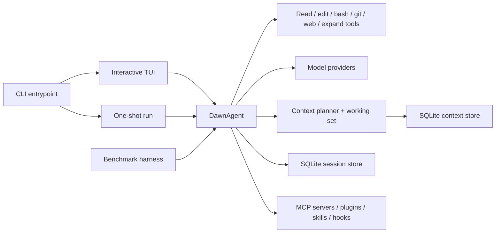

# Dawn

**A token-frugal coding agent for the terminal, built to spend less context.**

> Dollar-cheaper vs `--naive` and same-model peers is the goal — reclaim the “cheaper”
> tagline once the slice-aware benches in `bench/` pass the win bar in
> [docs/superpowers/specs/2026-07-24-cheaper-agent-thesis-design.md](docs/superpowers/specs/2026-07-24-cheaper-agent-thesis-design.md).

[](https://github.com/abmbodj/Dawn/actions/workflows/ci.yml)
[](./LICENSE)


Most terminal coding agents pay the same context bill again and again. They resend old
conversation turns, whole files, and giant tool outputs long after the useful signal has already
been extracted. Dawn starts from the opposite premise: context is a budget, not a bucket.

Dawn is a Bun and TypeScript AI coding agent with an interactive TUI, resumable sessions,
multi-provider model selection, permission prompts, one-shot automation, MCP/plugin/skill support,
and built-in reports that show what it read, spent, cached, compacted, and saved.


## Why Dawn Exists

Dawn is for developers who want a coding agent they can inspect and measure. The core thesis is
simple:

- Input tokens dominate many agent bills.
- Re-sending stale context is the easiest way to waste them.
- A coding agent should plan each request before it spends context.
- The tool should show the plan, the spend, and the savings instead of hiding them.

The committed benchmark snapshot (`bench/results.json`, 13 tasks × 2 reps on claude-haiku-4-5) shows
Dawn at **$0.0270 per successful task vs $0.0439 for its identical `--naive` baseline (−38%) and
$0.0697 for Claude Code on the same model (−61%), at identical 92% pass rates**. The win is a caching
win, not a token win: Dawn sends ~28% *more* input tokens than naive but bills most of them at
cache-read rates. Known open gap: single-turn investigate tasks still cost more than naive (see
`docs/audit/2026-07-cost-reliability-audit.md`). Treat `/savings` **Measured** rows as ledger truth
and **Estimated avoided** as a planner model. Re-run `bun run bench` to reproduce.

## Quickstart

Prerequisite: [Bun](https://bun.sh/) 1.3 or newer.

```bash
git clone https://github.com/abmbodj/Dawn.git
cd Dawn
bun run setup
dawn --help
```

Start Dawn in any project directory:

```bash
cd /path/to/your/project
dawn
```

On first launch, Dawn opens an interactive setup flow. For a low-friction first run, connect a free
or free-tier provider such as OpenRouter or Groq. You can also connect providers from the CLI:

```bash
dawn auth login openrouter
dawn auth login groq
dawn auth list
dawn models
```

Then ask Dawn a normal coding question or change request:

```text
Where is request retry handled?
```

```text
Add a test for the retry backoff edge case.
```

## Everyday Workflows

### Interactive TUI

```bash
dawn
```

The TUI is the primary Dawn experience. It streams model output, shows tool activity, supports slash
commands, prompts before side-effecting tools, and keeps sessions resumable.

Useful slash commands:

| Command | Purpose |
| --- | --- |
| `/model` | Switch models across connected providers. |
| `/plan-model` | Set the model used while in plan mode. |
| `/connect` | Connect another model provider. |
| `/context` | Show context budget, working set, and savings. |
| `/usage` | Show token and cost breakdown for the session. |
| `/savings` | Show measured usage vs estimated avoided context. |
| `/rewind` | Restore files and conversation to a previous checkpoint. |
| `/image` | Attach a local image file to the next message. |
| `/resume` | Pick a previous session for the current directory. |
| `/mcp` | Show connected MCP servers and tool counts. |
| `/plugin` | Show enabled plugins and plugin commands. |
| `/skills` | Show discovered and loaded skills. |

### One-shot Runs

```bash
dawn run "Explain how model fallback works in this repo"
```

One-shot mode is useful for scripts and automation. Reads are allowed by default. Use `--yolo` only
when the working tree is trusted or disposable:

```bash
dawn run "Update the README install section" --yolo
```

### Sessions

```bash
dawn --continue
```

Dawn persists sessions per project, so you can resume the most recent conversation with `-c` /
`--continue` or pick from prior sessions inside the TUI with `/resume`.

### Models and Providers

```bash
dawn models
dawn models anthropic
dawn models --refresh
dawn doctor models
```

Dawn can use hosted providers, local providers, and custom OpenAI-compatible endpoints. Provider
catalog data comes from `models.dev` with an offline fallback, and live provider probes refine the
available model list at runtime.

## CLI Reference

| Command | Description |
| --- | --- |
| `dawn` | Start an interactive session in the current directory. |
| `dawn -c`, `dawn --continue` | Resume the most recent session for this directory. |
| `dawn -m provider/model` | Start with a specific model. |
| `dawn --budget <tokens>` | Hard-cap estimated prompt tokens (default: adaptive by model/cache + context mode). |
| `dawn --context minimal|balanced|deep` | Choose the context planning mode. |
| `dawn --naive` | Run the same agent with summaries, trimming, compaction, and caching disabled. |
| `dawn run "<prompt>"` | Run one non-interactive task. |
| `dawn index` | Build or refresh the repo context index. |
| `dawn auth login <provider>` | Store a provider credential. |
| `dawn auth list` | Show configured providers. |
| `dawn auth logout <provider>` | Remove a stored provider credential. |
| `dawn models [provider]` | List known live models. |
| `dawn doctor models` | Smoke-test tool-capable models. |
| `dawn plugin add <git-url|path>` | Install a plugin. |
| `dawn plugin remove <name>` | Remove a plugin. |

## How Dawn Spends Less Context

Dawn's context system lives in `packages/core`. The important pieces are:

- **Adaptive budgets.** Without `--budget`, Dawn picks a lean budget for non-caching models and a
  larger cache-amortized budget for models with `cache_read` pricing (scaled by `minimal` /
  `balanced` / `deep`).
- **Repo summaries.** Dawn indexes files into compact summaries and reuses them instead of repeatedly
  loading full source files — and skips injecting them on trivial first turns that cannot amortize
  the cost.
- **Working-set leases.** Files, ranges, summaries, and tool outputs stay available for a few turns,
  then expire when they are no longer useful.
- **Atomic history trimming.** Old messages are dropped by budget while tool-call/tool-result pairs
  stay valid.
- **Bounded reads.** Read tools cap line counts by context mode and tell the model how to continue.
- **Tool-output compaction.** Large command output is compacted by shape: logs, JSON, grep results,
  and free text each get different treatment.
- **Expandable originals.** Compacted tool output stores the full original and exposes an `expand`
  marker so the model can retrieve details without rerunning the command.
- **Prompt caching.** Cache-capable providers amortize stable context; Anthropic/Bedrock Claude also
  get explicit cache breakpoints.
- **Visible accounting.** `/context`, `/usage`, and `/savings` split **Measured** ledger spend from
  **Estimated avoided** planner savings — never one blended “saved $X”.

## Benchmark

Dawn includes a benchmark harness in [`bench/`](./bench/) that compares:

- `dawn`: default balanced mode with context management enabled.
- `naive`: the same Dawn agent with context management disabled.
- `claude`: optional Claude Code comparison when the `claude` CLI is available (primary peer).
- `aider`: optional Aider comparison when the `aider` CLI is available (secondary sanity check).

Tasks are tagged with proof **slices** (`trivial` / `investigate` / `edit` / `long`). The win bar is
slice-aware: Dawn should win **$ on investigate + long**, keep overall **$ ≤ `--naive`**, and may
tie/lose on trivial turns. Reports print overall and per-slice medians.

The rigorous comparison is Dawn versus `--naive`, because it uses the same model, tools, system
prompt, and loop. Claude Code / Aider columns are indicative (same-model when configured).

**Automation:** PR CI runs deterministic planner unit tests (`bun test`). Paid benches are
nightly/on-demand (`bun run bench`) — not a PR gate.

<!-- BENCH:START -->
**Headline — cost per successful task (all reps charged, failures included):**

| Agent | Pass rate | Total $ | $ / successful task |
| --- | --: | --: | --: |
| Dawn | 24/26 | $0.6476 | $0.0270 |
| Naive | 24/26 | $1.0544 | $0.0439 |
| Claude Code (13-task subset) | 24/26 | $1.6731 | $0.0697 |
| Dawn (same subset) | 24/26 | $0.6476 | $0.0270 |

**Headline gate: pass** — pass-rate parity (dawn 92% vs naive 92%): ok; $/success (dawn ≤ naive): ok.


**Across 12 comparable task(s) at equal success, Dawn used a median 24% more input tokens (caching discount offsets cost) and 38% less cost than the naive baseline (pooled: +28% tokens vs naive, −38% cost).**

**Overall $ gate (Dawn ≤ naive): pass.**


**Win bar (slice-aware):** overall Dawn $ ≤ naive $; win $ on investigate + long; trivial may tie/lose.

| Slice | Comparable tasks | Median input ↓ | Median cost ↓ | Gate |
| --- | --: | --: | --: | --- |
| trivial | 1 | 0% | 28% | informational |
| investigate | 2 | -129% | -35% | fail ($ lose) |
| edit | 1 | -23% | 32% | ok |
| long | 2 | -11% | 47% | pass ($ win) |
| probe | 6 | -26% | 47% | reliability (pass rate is the metric) |


### trivial

_trivial: median **0% fewer input tokens**, **28% less cost** (1 task(s) at equal success)_

| Task (pass rate) | Dawn input (cached) | Naive input | Input ↓ | Dawn $ | Naive $ | Cost ↓ | Claude input | Claude $ |
| --- | --: | --: | --: | --: | --: | --: | --: | --: |
| [trivial] trivial-hello (d:2/2 n:2/2) | 12,288 (5,774) | 12,293 | −0% | $0.0094 | $0.0131 | −28% | 26,337 (c:2/2) | $0.0274 |

### read-heavy

_read-heavy: median **224% more input tokens**, **70% more cost** (1 task(s) at equal success)_

| Task (pass rate) | Dawn input (cached) | Naive input | Input ↓ | Dawn $ | Naive $ | Cost ↓ | Claude input | Claude $ |
| --- | --: | --: | --: | --: | --: | --: | --: | --: |
| [investigate] cat-budget (d:2/2 n:2/2) | 60,211 (36,138) | 18,574 | +224% | $0.0340 | $0.0200 | +70% | 60,747 (c:2/2) | $0.0477 |
| [investigate] grep-exports ⚠️ (d:1/2 n:0/2) | 17,754 (8,345) | 21,292 | −17% | $0.0133 | $0.0223 | −40% | 53,983 (c:1/2) | $0.0329 |

### edit

_edit: median **21% more input tokens** (caching discount offsets cost), **42% less cost** (2 task(s) at equal success)_

| Task (pass rate) | Dawn input (cached) | Naive input | Input ↓ | Dawn $ | Naive $ | Cost ↓ | Claude input | Claude $ |
| --- | --: | --: | --: | --: | --: | --: | --: | --: |
| [edit] edit-maxreadchars (d:2/2 n:2/2) | 54,147 (30,702) | 44,050 | +23% | $0.0319 | $0.0472 | −32% | 98,807 (c:2/2) | $0.0580 |
| [long] mt-edit-sequence (d:2/2 n:2/2) | 55,278 (41,227) | 46,772 | +18% | $0.0244 | $0.0497 | −51% | 170,782 (c:2/2) | $0.0806 |

### diagnosis

_diagnosis: median **19% more input tokens** (caching discount offsets cost), **22% less cost** (2 task(s) at equal success)_

| Task (pass rate) | Dawn input (cached) | Naive input | Input ↓ | Dawn $ | Naive $ | Cost ↓ | Claude input | Claude $ |
| --- | --: | --: | --: | --: | --: | --: | --: | --: |
| [investigate] pilot-diagnosis-maxreadlines (d:2/2 n:2/2) | 20,047 (8,237) | 14,935 | +34% | $0.0156 | $0.0157 | −0% | 62,701 (c:2/2) | $0.0480 |
| [long] mt-diagnosis-recall (d:2/2 n:2/2) | 60,152 (37,068) | 58,305 | +3% | $0.0342 | $0.0610 | −44% | 157,745 (c:2/2) | $0.0677 |

### probe

_probe: median **26% more input tokens** (caching discount offsets cost), **47% less cost** (6 task(s) at equal success)_

| Task (pass rate) | Dawn input (cached) | Naive input | Input ↓ | Dawn $ | Naive $ | Cost ↓ | Claude input | Claude $ |
| --- | --: | --: | --: | --: | --: | --: | --: | --: |
| [probe] probe-recover-failing-run (d:2/2 n:2/2) | 68,233 (56,426) | 52,021 | +31% | $0.0232 | $0.0557 | −58% | 170,258 (c:2/2) | $0.0779 |
| [probe] probe-stale-edit (d:1/2 n:2/2) | 61,576 (47,809) | 48,262 | +28% | $0.0245 | $0.0515 | −52% | 112,839 (c:2/2) | $0.0690 |
| [probe] probe-multifile-rename (d:2/2 n:2/2) | 53,597 (36,534) | 48,434 | +11% | $0.0300 | $0.0561 | −47% | 273,266 (c:2/2) | $0.1231 |
| [probe] probe-ambiguous-delete (d:2/2 n:2/2) | 11,424 (5,633) | 11,425 | −0% | $0.0085 | $0.0120 | −29% | 52,950 (c:1/2) | $0.0307 |
| [probe] probe-long-recall (d:2/2 n:2/2) | 93,032 (67,113) | 74,819 | +24% | $0.0413 | $0.0781 | −47% | 370,559 (c:2/2) | $0.1058 |
| [probe] probe-minimal-diff (d:2/2 n:2/2) | 51,174 (29,290) | 38,217 | +34% | $0.0338 | $0.0450 | −25% | 153,794 (c:2/2) | $0.0579 |


_Measured by anthropic/claude-haiku-4-5-20251001, Claude Code on claude-haiku-4-5-20251001, Dawn repo @ 79df0174, 2 rep(s)/task (median), 2026-07-25._


_The Claude Code column is **indicative, not apples-to-apples**: same model and task, but a different agent (its own system prompt, tools, and loop). Aider is a secondary sanity check. The rigorous comparison is Dawn vs. `--naive` — the identical agent with context management turned off. ⚠️ marks tasks where a mode did not pass its correctness check; those are excluded from the medians._


```bash
# Reproduce (requires credentials; optional `claude` / `aider` CLIs):
bun run bench        # real API spend, non-deterministic — nightly/on-demand, not PR CI
bun run bench:report # regenerate this table

# Free local verification of the mechanism delta (Dawn vs --naive only):
bun run bench -- --no-claude --no-aider --model ollama/<model>   # or groq/<model>
```
<!-- BENCH:END -->

The snapshot above is intentionally generated from the committed `bench/results.json`. Rerun the
harness when you want broader evidence across more tasks, repetitions, providers, or models.

## Configuration

Dawn reads global config from `~/.config/dawn/config.json` and project config from `dawn.json`.
Project config overrides global config, with provider and MCP definitions merged.

Set a default model:

```json
{
  "model": "openrouter/deepseek/deepseek-chat-v3-0324:free"
}
```

Add a custom OpenAI-compatible provider:

```json
{
  "providers": {
    "huggingface": {
      "name": "Hugging Face",
      "baseURL": "https://router.huggingface.co/v1",
      "apiKeyEnv": "HF_TOKEN"
    }
  }
}
```

Pre-approve or deny tools:

```json
{
  "permissions": {
    "read": "allow",
    "bash": "ask",
    "edit": "ask"
  }
}
```

Configure MCP servers using the Claude Code `.mcp.json` shape:

```json
{
  "mcpServers": {
    "example": {
      "command": "node",
      "args": ["server.js"]
    }
  }
}
```

## Architecture



The repo is split into a small CLI entrypoint, shared core agent logic in `packages/core`, terminal UI
code in `packages/tui`, and benchmark scripts in `bench`.

## Development

```bash
bun install
bun run setup
bun test
bun run typecheck
bun run check
bun run preflight
```

Repo layout:

| Path | Purpose |
| --- | --- |
| `index.ts` | Dawn CLI entrypoint and command routing. |
| `packages/core` | Agent loop, providers, context budgeting, tools, sessions, config, MCP, plugins, skills. |
| `packages/tui` | Terminal UI, setup flow, slash commands, status views, markdown rendering. |
| `bench` | Measured token/cost benchmark harness and report generator. |

For contribution expectations, see [`CONTRIBUTING.md`](./CONTRIBUTING.md). For vulnerability
reporting, see [`SECURITY.md`](./SECURITY.md).

## License

MIT. See [`LICENSE`](./LICENSE).
