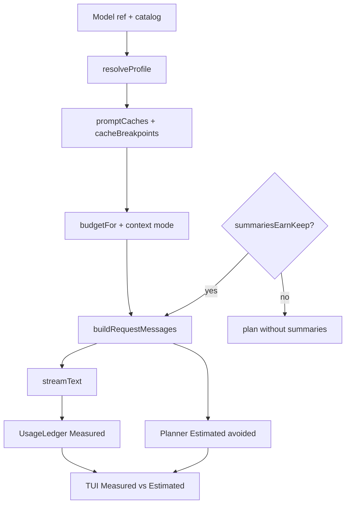

# Dawn Cheaper-Agent Thesis Design

**Date:** 2026-07-24  
**Approach:** Economics-core first (planner saves $ before economy defaults)

## Goals

Make Dawn’s product claim true under a dual north star:

1. **Fewer input tokens** per turn/session (engineering lever Dawn already has).
2. **Lower $ at equal quality** (product truth). Quality = automated task success **and** a human rubric (correctness, minimal diff, low thrash).

## Non-goals (this milestone)

- Cheap-by-default / economy model preset
- Hard spend caps (`maxCostUsd`)
- Tokenizer upgrade beyond `chars÷4`
- LLM file-summary rewrite
- Subagents / difficulty routing for the primary model

## Success criteria (win bar)

Same model, task success holds:

- **Overall:** Dawn planner **$ ≤ Dawn `--naive` $**
- **Slices:** win **$ on investigate + long**; trivial may tie/lose
- **Competitors (indicative):** same slice lens vs Claude Code (primary) and Aider (secondary)
- **Tagline:** lead with token-/context-frugal until gates pass; reclaim “cheaper” after proof

## Architecture

### Cache capability profile

Replace the Anthropic-only `supportsCaching` boolean with two fields on `ModelProfile`:

| Field | Meaning | Drives |
| --- | --- | --- |
| `promptCaches` | Catalog `cache_read` **or** Anthropic/Bedrock Claude breakpoints | Adaptive budget, summary share |
| `cacheBreakpoints` | Explicit `cacheControl: ephemeral` markers | System / summary / last-message breakpoints |

### Adaptive budget

- CLI/`dawn run`: **omit** `tokenBudget` unless `--budget` is set → `budgetFor(profile, info, mode)`
- Caching models: fraction of context window by mode (`minimal` 35%, `balanced` 65%, `deep` 80%), capped at 200k
- Non-caching: lean budgets scaled lightly by mode
- `--budget` remains a hard override

### Pay-for-itself summary injection

Keep heuristic summaries. Skip injecting the summary block on **trivial first turns** (empty working set, single user turn, non-investigative short query) so summary/cache-write tax cannot exceed benefit.

### Measurement UX

Split `/savings` and the savings box into:

- **Measured** — provider usage ledger (tokens, cache, $)
- **Estimated avoided** — planner model (trim/summary/compaction vs naive baseline)

Never blend into one “saved $X” headline.

### Proof automation

- **PR CI:** deterministic planner invariant unit tests (already via `bun test`)
- **Nightly / on-demand:** `bun run bench` — `--naive` $ gate + per-slice report; Claude Code + Aider when CLIs exist

## Rollout order

1. Cache profile + adaptive budget wiring + summary pay-for-itself + invariant tests
2. Measured vs Estimated UX + README tagline soften
3. Bench slices + Aider harness + win-bar docs
